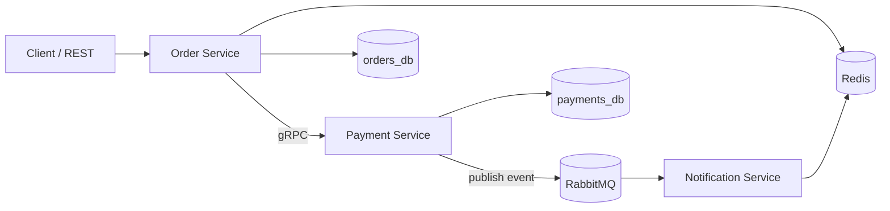

# ap_2 – Performance Optimization & External Integrations

**Student:** Nazarbek Amanbek | **Group:** SE-2401

Builds on the earlier Order, Payment, and Notification microservices with RabbitMQ.

## Project Diagram



---

## What's New in Assignment 4

| Feature | Location | Approach |
|---|---|---|
| Redis cache-aside | `order-service/internal/cache/` | Cache-aside |
| Cache invalidation | `order-service/internal/usecase/order.go` | Invalidate after writes |
| Rate limiter | `order-service/internal/middleware/rate_limiter.go` | Sliding-window counter in Redis |
| Email provider adapter | `notification-service/internal/provider/` | Adapter |
| Retry backoff | `notification-service/internal/retry/backoff.go` | Delay doubles on each retry |
| Redis idempotency | `notification-service/internal/idempotency/redis.go` | Payment ID key in Redis |

---

## 1. Caching Strategy (Order Service)

### Cache-aside

```
GET /orders/:id
       │
       ▼
  Redis GET key=order:{id}
       │
  ┌────┴────┐
  │  HIT?   │──YES──► return cached order (fast path, ~1ms)
  └────┬────┘
       │ NO (miss)
       ▼
  PostgreSQL SELECT
       │
       ▼
  Redis SET key=order:{id} TTL=5m
       │
       ▼
  return order
```

### Cache invalidation

Invalidation happens **atomically after every database write** — before the HTTP response is returned. This prevents stale data scenarios (e.g. showing "Pending" for a paid order).

**Invalidation trigger points:**
- `CreateOrder` → after payment status update
- `CancelOrder` → after status set to "cancelled"
- Any payment failure → after status set to "failed"

**TTL:** 5 minutes (configurable via `CACHE_TTL` env var). Acts as a safety net for any edge cases.

---

## 2. External provider adapter (Notification Service)

The `EmailSender` interface decouples business logic from the email provider:

```go
type EmailSender interface {
    Send(ctx context.Context, msg EmailMessage) error
}
```

Two implementations:

| Mode | `PROVIDER_MODE` | Implementation | Notes |
|---|---|---|---|
| Simulated | `SIMULATED` (default) | `SimulatedProvider` | Random failure rate with short latency |
| Real | `REAL` | `SMTPProvider` | Connects to SMTP via `SMTP_*` env vars |

The provider is selected at startup via `PROVIDER_MODE`.

---

## 3. Background jobs – retry and idempotency

### Exponential backoff

```
Attempt 1  → fails → wait 2s
Attempt 2  → fails → wait 4s
Attempt 3  → fails → wait 8s
Attempt 4  → fails → wait 16s
Attempt 5  → fails → NACK → Dead Letter Queue
```

Formula: `delay = min(baseDelay × 2^(attempt-1), maxDelay)`

Config (all via `.env`):
- `RETRY_MAX_ATTEMPTS=5`
- `RETRY_BASE_DELAY=2s`
- `RETRY_MAX_DELAY=30s`

### Idempotency (Redis)

Before sending, the worker checks Redis:
```
Redis GET  notification:idempotency:{payment_id}
    HIT  → skip (already processed, return false, nil)
    MISS → send email → Redis SET notification:idempotency:{payment_id} "processed" TTL=24h
```

This prevents duplicate emails when RabbitMQ redelivers a message after a crash.

---

## 4. Bonus – Rate limiter (Redis sliding window)

`GET /orders/:id`, `POST /orders`, etc. are protected by a per-IP rate limiter:
- **Default:** 10 requests per minute
- **Returns:** `HTTP 429 Too Many Requests` when exceeded
- **Headers:** `X-RateLimit-Limit`, `X-RateLimit-Remaining`

Implementation uses Redis `INCR` + `EXPIRE` in a pipeline.

---

## Running Locally

```bash
docker compose up --build

curl -X POST http://localhost:8080/orders \
     -H "Content-Type: application/json" \
     -d '{"customer_id":"cust-1","item_name":"Laptop","amount":99900}'

curl http://localhost:8080/orders/{id}

for i in $(seq 1 12); do curl -s -o /dev/null -w "%{http_code}\n" http://localhost:8080/orders/fake; done

docker compose logs -f notification-service
docker compose logs -f order-service
```

---

## Environment Variables

See `.env` for all configuration. Key variables:

| Variable | Default | Description |
|---|---|---|
| `CACHE_TTL` | `5m` | Order cache TTL in Redis |
| `RATE_LIMIT_REQUESTS` | `10` | Max requests per window per IP |
| `RATE_LIMIT_WINDOW` | `1m` | Rate limit window duration |
| `PROVIDER_MODE` | `SIMULATED` | Email provider: `REAL` or `SIMULATED` |
| `RETRY_MAX_ATTEMPTS` | `5` | Max notification send attempts |
| `RETRY_BASE_DELAY` | `2s` | Initial retry delay |
| `RETRY_MAX_DELAY` | `30s` | Maximum retry delay cap |
| `IDEMPOTENCY_TTL` | `24h` | Redis key TTL for processed payments |
