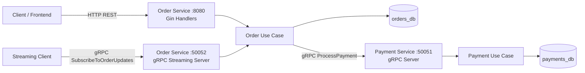

# Architecture Diagram (Assignment 2)

## Notes

- External API remains REST via Gin in Order Service.
- Internal communication Order -> Payment is gRPC.
- Streaming endpoint belongs to Order Service and emits updates from real DB state changes.
